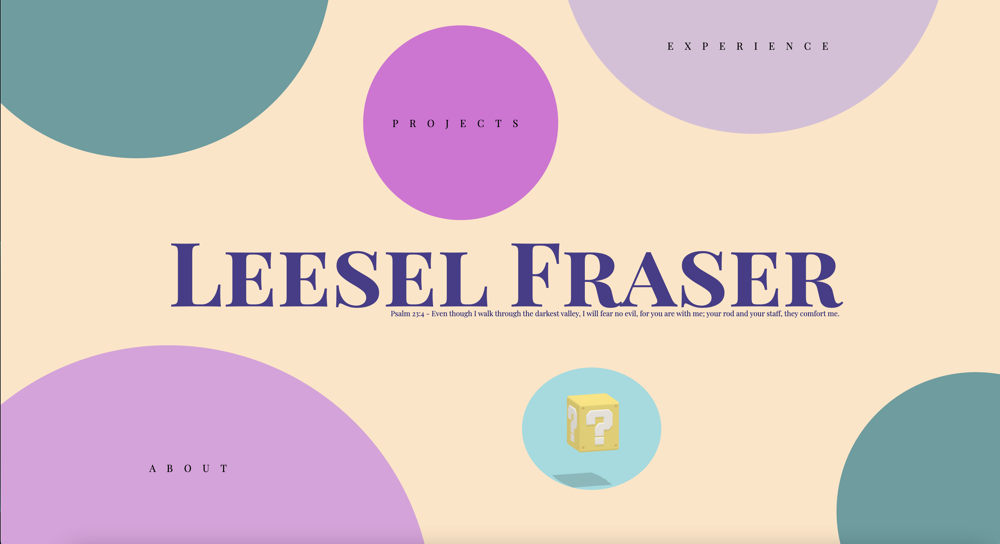
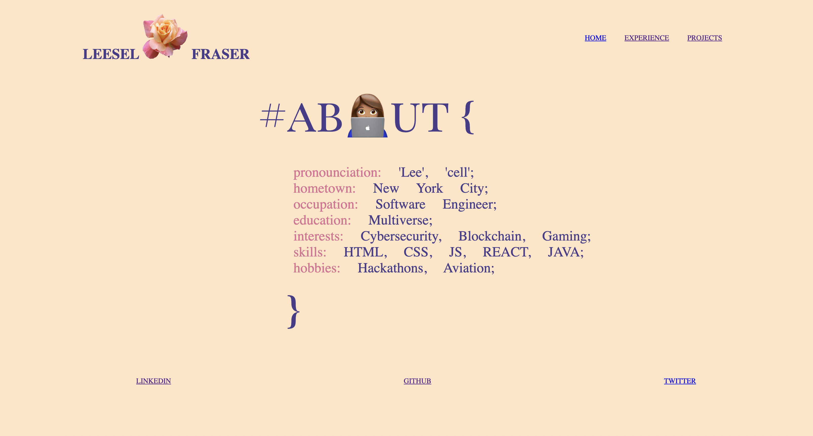
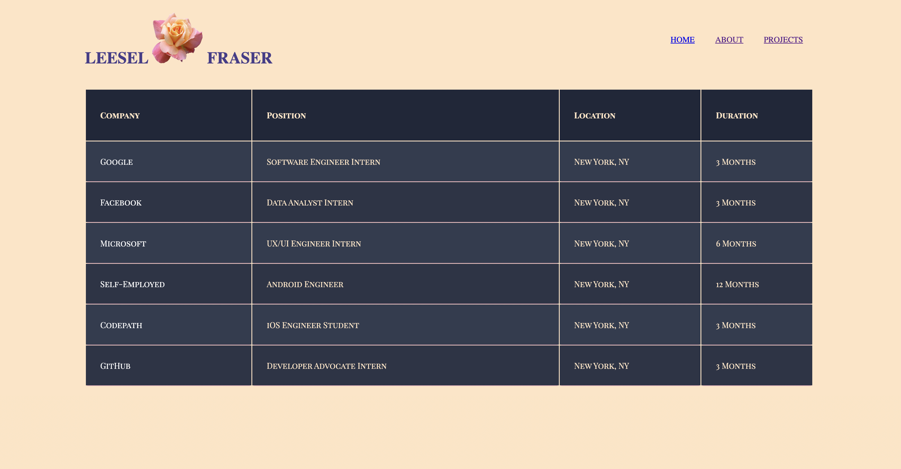
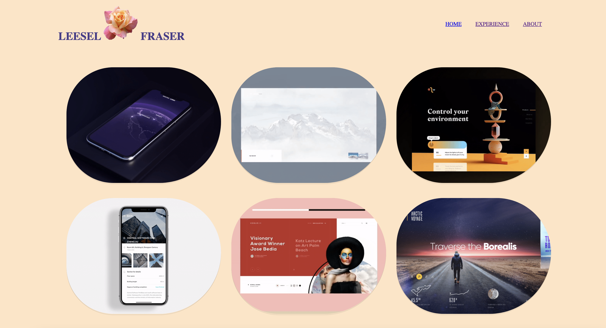

# W4D1-Project-1-HTML-CSS

A personal website portfolio made with HTML and CSS

## Home Page

## About Page

## Experience Page

## Projects Page

## Mystery Box Page

😊 Click the link in the website if you are feeling adventurous 😊
